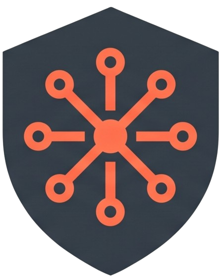
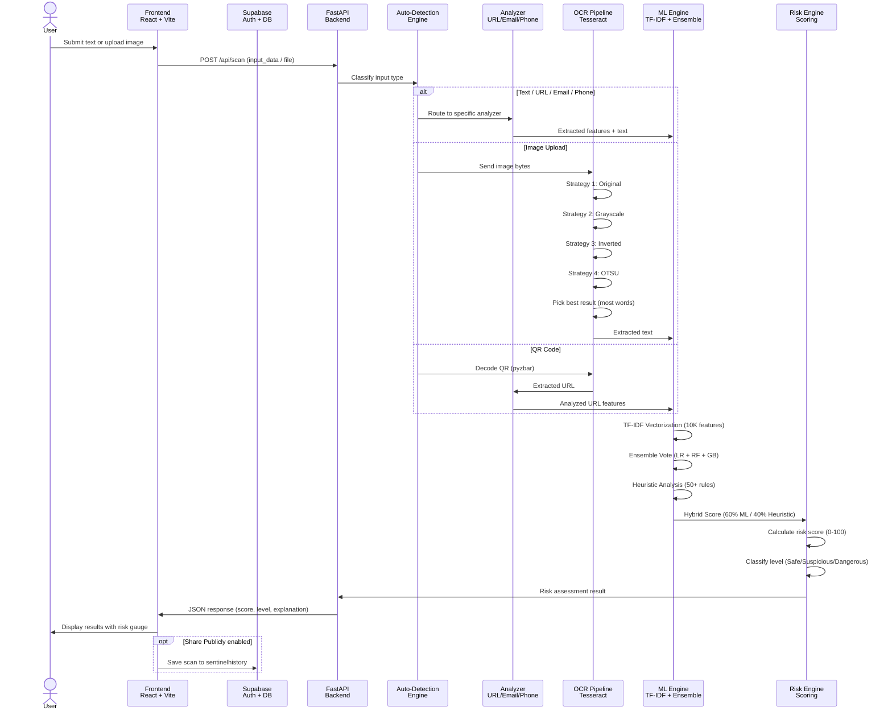
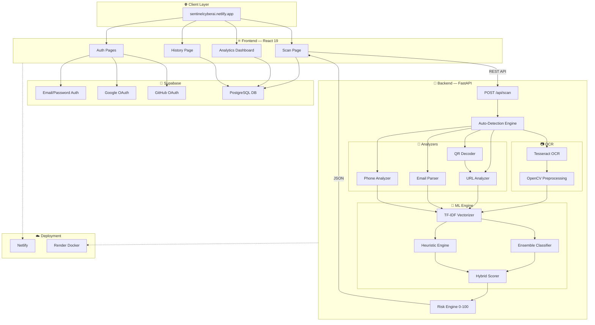

<p align="center">
  
</p>

<h1 align="center">Sentinel AI</h1>

<p align="center">
  <strong>AI-Powered Multimodal Phishing & Scam Detection Platform</strong>
</p>

<p align="center">
  <a href="https://sentinelcyberai.netlify.app"></a>
</p>

<p align="center">
  <a href="#-features"></a>
  <a href="#-tech-stack"></a>
  <a href="#-tech-stack"></a>
  <a href="#-tech-stack"></a>
  <a href="#-tech-stack"></a>
  <a href="#license"></a>
</p>

<p align="center">
  Sentinel is a production-grade, full-stack cybersecurity platform that uses <strong>machine learning</strong>, <strong>natural language processing</strong>, and <strong>computer vision</strong> to detect phishing, scams, and malicious content across <em>six different input modalities</em> — all from a single, unified interface.
</p>

<br/>

> [!WARNING]
> **Image Scanning on Live Demo:** The hosted demo at [sentinelcyberai.netlify.app](https://sentinelcyberai.netlify.app) runs on **Render's free tier** with limited CPU & RAM. Image/OCR scans may be **slow or timeout**. Text, URL, email, and phone scans work perfectly. For reliable image scanning, **fork this repo and run the backend locally** — see [Getting Started](#-getting-started).

---

## 📖 Table of Contents

- [✨ Features](#-features)
- [🛡️ Supported Input Types](#️-supported-input-types)
- [🏗️ Architecture](#️-architecture)
- [🧠 AI / ML Pipeline](#-ai--ml-pipeline)
- [🖥️ Tech Stack](#️-tech-stack)
- [🚀 Getting Started](#-getting-started)
- [📡 API Reference](#-api-reference)
- [🔧 Configuration](#-configuration)
- [🐳 Docker Deployment](#-docker-deployment)
- [📊 Model Training](#-model-training)
- [📂 Project Structure](#-project-structure)
- [🤝 Contributing](#-contributing)
- [📝 License](#-license)

---

## ✨ Features

| Feature | Description |
|---|---|
| 🧠 **Hybrid ML + Heuristic Detection** | Ensemble classifier (Logistic Regression + Random Forest + Gradient Boosting) combined with 50+ rule-based heuristics for high-accuracy threat detection |
| 🔍 **Auto-Detection Engine** | Automatically identifies input type (URL, email, phone, text) and routes to the appropriate analysis pipeline |
| 📷 **OCR & Image Scanning** | Tesseract OCR with multi-strategy preprocessing (original, grayscale, inverted, OTSU) for robust text extraction from screenshots |
| 📱 **QR Code Decoding** | Detects and decodes QR codes from uploaded images, then analyzes embedded URLs for threats |
| 🌐 **Advanced URL Analysis** | Shannon entropy calculation, Levenshtein-distance typosquatting detection, suspicious TLD checking, and URL structure analysis |
| 📧 **Email Header Forensics** | Parses From/Reply-To/Return-Path headers, detects display name spoofing, domain mismatches, and brand impersonation |
| 📞 **Phone Number Risk Assessment** | 60+ high-risk area codes and country code database with VoIP pattern detection and number anomaly analysis |
| 📊 **Real-Time Analytics Dashboard** | Live threat feed, risk trend charts, threat distribution pie chart, and input volume bar chart powered by Recharts |
| ☁️ **Supabase Integration** | Optional cloud persistence — users can opt-in to share scan results publicly for community threat intelligence |
| 🔐 **Supabase Auth** | Email/password authentication with Google & GitHub OAuth integration |
| 🐳 **Docker Ready** | Production Dockerfile included for containerized backend deployment with Tesseract OCR pre-installed |

---

## 🛡️ Supported Input Types

<table>
  <tr>
    <td align="center">🌐<br/><strong>URLs & Links</strong><br/><sub>Domain entropy, TLD analysis, typosquatting</sub></td>
    <td align="center">💬<br/><strong>SMS / Text</strong><br/><sub>NLP urgency detection, keyword matching</sub></td>
    <td align="center">📧<br/><strong>Emails</strong><br/><sub>Header forensics, spoofing detection</sub></td>
  </tr>
  <tr>
    <td align="center">📞<br/><strong>Phone Numbers</strong><br/><sub>Area code risk DB, VoIP detection</sub></td>
    <td align="center">📱<br/><strong>QR Codes</strong><br/><sub>Decode + analyze embedded content</sub></td>
    <td align="center">🖼️<br/><strong>Images / Screenshots</strong><br/><sub>Tesseract OCR extraction + threat analysis</sub></td>
  </tr>
</table>

---

## 🏗️ Architecture

```
┌─────────────────────────────────────────────────────────────────┐
│                    FRONTEND (React 19 + Vite)                   │
│  ┌──────────┐  ┌──────────┐  ┌──────────┐  ┌───────────────┐   │
│  │  Scanner  │  │Dashboard │  │ History  │  │ About/Contact │   │
│  │   Page    │  │ Analytics│  │  Page    │  │    Pages      │   │
│  └────┬─────┘  └────┬─────┘  └────┬─────┘  └───────────────┘   │
│       └──────────────┴─────────────┘                             │
│                      │                                           │
│              ┌───────┴────────┐                                  │
│              │  API Service   │ ←── Supabase (optional cloud DB) │
│              └───────┬────────┘                                  │
└──────────────────────┼──────────────────────────────────────────┘
                       │  HTTP / REST
┌──────────────────────┼──────────────────────────────────────────┐
│                  BACKEND (FastAPI + Python)                      │
│              ┌───────┴────────┐                                  │
│              │  Unified Scan  │  POST /api/scan                  │
│              │   Endpoint     │                                  │
│              └───────┬────────┘                                  │
│                      │                                           │
│         ┌────────────┼────────────┐                              │
│         │    Auto-Detection       │                              │
│         │  URL │ Email │ Phone │ Text │ Image │ QR              │
│         └──┬─────┬──────┬──────┬──────┬───────┬─┘               │
│            │     │      │      │      │       │                  │
│  ┌─────────▼┐ ┌──▼───┐ ┌▼────┐ ┌▼────┐ ┌▼───┐ ┌▼────┐         │
│  │URL       │ │Email │ │Phone│ │Text │ │OCR │ │QR   │          │
│  │Analyzer  │ │Parser│ │Anlzr│ │Clsfr│ │Proc│ │Decdr│          │
│  └─────────┘ └──────┘ └─────┘ └──┬──┘ └────┘ └─────┘          │
│                                   │                              │
│                    ┌──────────────┴──────────────┐               │
│                    │     ML Phishing Classifier    │              │
│                    │  (TF-IDF + Ensemble Voting)   │              │
│                    └──────────────┬──────────────┘               │
│                                   │                              │
│                          ┌────────▼────────┐                     │
│                          │  Risk Engine     │                     │
│                          │  (0-100 Scoring) │                     │
│                          └─────────────────┘                     │
└──────────────────────────────────────────────────────────────────┘
```

### Sequence Diagram — Scan Request Flow



### Component Diagram



---

## 🧠 AI / ML Pipeline

### Hybrid Scoring Strategy

The detection engine combines **two scoring approaches** for maximum accuracy:

| Component | Weight | Description |
|---|---|---|
| **ML Model** | 60% (when confident) | Pre-trained ensemble classifier: Logistic Regression + Random Forest + Gradient Boosting with soft voting |
| **Heuristic Engine** | 40% (when ML is confident) | 50+ keyword dictionaries, 15 regex patterns, statistical text features |

> When the ML model's confidence is low (< 30%), the weighting dynamically shifts to **40% ML / 60% heuristics**. If the model fails entirely, it falls back to **100% heuristic analysis**.

### Feature Extraction

```
Text Input
    │
    ├─── Urgency Analysis ────────── 30 urgency keywords/phrases
    ├─── Credential Harvesting ───── 42 credential-related terms
    ├─── Fear Manipulation ───────── 37 fear/threat keywords
    ├─── Financial Fraud ─────────── 41 payment/reward terms
    ├─── Impersonation Detection ─── 12 generic greeting patterns
    ├─── Regex Pattern Matching ──── 15 suspicious URL/content patterns
    ├─── Statistical Features ────── Caps ratio, exclamation density, URL count
    │
    └─── TF-IDF Vectorization ────── 10,000 features, (1,3) n-grams
         └── Ensemble Classifier ──── VotingClassifier (soft)
              ├── LogisticRegression (C=1.0, balanced)
              ├── RandomForest (100 trees, depth=15)
              └── GradientBoosting (100 trees, lr=0.1)
```

### URL Analysis Features

- **Shannon Entropy** — Detects randomly-generated domains
- **Levenshtein Distance** — Catches typosquatting (e.g., `amaz0n.com`, `paypa1.com`)
- **TLD Risk Scoring** — 30+ known phishing TLDs (`.xyz`, `.tk`, `.ml`, etc.)
- **URL Shortener Detection** — 20+ shortener services
- **Structural Analysis** — Path depth, IP-based URLs, `@` symbol abuse, double-slash redirects

### OCR Pipeline (Image Scanning)

Sentinel uses **Tesseract OCR** with a multi-strategy approach for maximum text extraction:

```
Uploaded Image
    │
    ├─── Strategy 1: Original (color) ──────── Best for clean screenshots
    ├─── Strategy 2: Grayscale ─────────────── Good for most images
    ├─── Strategy 3: Inverted ──────────────── Light text on dark backgrounds
    └─── Strategy 4: OTSU Threshold ────────── Low contrast images
         │
         └── Pick result with most words extracted → ML Analysis
```

---

## 🖥️ Tech Stack

### Frontend

| Technology | Purpose |
|---|---|
| **React 19** | UI Framework |
| **TypeScript** | Type Safety |
| **Vite 6** | Build Tool & Dev Server |
| **Tailwind CSS 3** | Utility-First Styling |
| **Recharts** | Data Visualization (Area, Pie, Bar charts) |
| **Lucide React** | Icon Library |
| **React Router 7** | Client-Side Routing |
| **Supabase JS** | Auth & Database Client |

### Backend

| Technology | Purpose |
|---|---|
| **FastAPI** | API Framework (async, auto-docs) |
| **Python 3.11+** | Runtime |
| **Scikit-learn** | ML Pipeline (TF-IDF + Ensemble) |
| **Tesseract OCR** | Optical Character Recognition |
| **OpenCV** | Image Preprocessing |
| **pyzbar** | QR Code Decoding |
| **Pydantic v2** | Request/Response Validation |
| **tldextract** | Domain Parsing |
| **pandas** | Dataset Processing |
| **joblib** | Model Serialization |

### Infrastructure

| Technology | Purpose |
|---|---|
| **Netlify** | Frontend Hosting |
| **Render** | Backend Hosting (Docker) |
| **Supabase** | Auth, Database (PostgreSQL) |
| **Docker** | Containerized Backend Deployment |

---

## 🚀 Getting Started

### Prerequisites

- **Node.js** ≥ 18.x
- **Python** ≥ 3.11
- **Tesseract OCR** — [Install guide](#tesseract-installation)
- **Git**

### 1. Clone the Repository

```bash
git clone https://github.com/Patel-Priyank-1602/Sentinel_Cyber_AI.git
cd Sentinel_Cyber_AI
```

### 2. Backend Setup

```bash
# Navigate to the backend
cd backend

# Create a virtual environment (recommended)
python -m venv venv

# Activate it
# Windows:
venv\Scripts\activate
# macOS/Linux:
source venv/bin/activate

# Install dependencies
pip install -r requirements.txt

# Create .env file
cp .env.example .env
# Edit .env and add your Supabase credentials (optional)

# Start the API server
uvicorn main:app --reload
```

> The API will be available at `http://localhost:8000`. Interactive docs at `http://localhost:8000/docs`.

### 3. Frontend Setup

```bash
# Open a new terminal, navigate to frontend
cd frontend

# Install dependencies
npm install

# Create environment file
cp .env.example .env
# Edit .env — set VITE_API_URL=http://localhost:8000

# Start dev server
npm run dev
```

> The app will be available at `http://localhost:5173`.

### 4. Tesseract Installation

Tesseract OCR is required for image scanning:

| Platform | Command |
|---|---|
| **Windows** | `winget install UB-Mannheim.TesseractOCR` |
| **macOS** | `brew install tesseract` |
| **Ubuntu/Debian** | `sudo apt-get install tesseract-ocr` |
| **Docker** | Already included in the Dockerfile |

> On Windows, Tesseract installs to `C:\Program Files\Tesseract-OCR\` — the app auto-detects this path.

### 5. (Optional) Train the ML Model

```bash
cd backend

# Place CSV datasets in:
#   backend/dataset/spam/
#   backend/dataset/mail/
#   backend/dataset/url/

# Run the training pipeline
python -m ml.train_model
```

> The trained model is saved to `backend/ml/trained_models/full_pipeline.pkl` and auto-loaded on server restart. If no trained model exists, the server uses a built-in fallback dataset.

---

## 📡 API Reference

### Root

```http
GET /
```

```json
{
  "name": "Sentinel AI API",
  "version": "1.0.0",
  "status": "operational",
  "timestamp": "2026-05-22T12:00:00.000Z"
}
```

### Health Check

```http
GET /health
```

```json
{ "status": "healthy", "ai_engine": "active" }
```

### Unified Scan

```http
POST /api/scan
Content-Type: multipart/form-data
```

| Field | Type | Required | Description |
|---|---|---|---|
| `input_data` | `string` | No* | Text, URL, email, or phone number to analyze |
| `file` | `file` | No* | Image file for OCR/QR scanning (max 10MB) |

> *At least one of `input_data` or `file` must be provided.

**Response** `200 OK`:

```json
{
  "id": "uuid-v4",
  "risk_score": 85,
  "risk_level": "Dangerous",
  "scan_type": "text",
  "attack_type": "Phishing / Credential Harvesting",
  "phishing_probability": 0.85,
  "detected_type": "text",
  "explanation": [
    "🤖 AI Model detected phishing patterns (confidence: 92%)",
    "⚠️ Urgency manipulation — pressure tactics to force immediate action",
    "🔑 Credential harvesting attempt — requesting sensitive login information"
  ],
  "recommendations": [
    "🚫 Do NOT interact with this content or click any links",
    "📢 Report this to your service provider or IT security team"
  ],
  "features": {
    "urgency_score": 0.667,
    "credential_request": true,
    "suspicious_keywords": ["password", "verify your", "suspended"]
  },
  "created_at": "2026-05-22T12:00:00.000000+00:00"
}
```

### Scan History

```http
GET /api/scans          # List all scans
GET /api/scans/:id      # Get specific scan
DELETE /api/scans/:id   # Delete a scan
```

---

## 🔧 Configuration

### Backend `.env`

```env
SUPABASE_URL=your_supabase_url
SUPABASE_KEY=your_supabase_key
```

### Frontend `.env`

```env
# Backend API URL (use http://localhost:8000 for local development)
VITE_API_URL=http://localhost:8000

# Supabase (for auth & cloud persistence)
VITE_SUPABASE_URL=your_supabase_url
VITE_SUPABASE_ANON_KEY=your_supabase_anon_key
```

### Supabase Setup (Optional)

1. Create a free project at [supabase.com](https://supabase.com)
2. Enable **Email/Password**, **Google**, and **GitHub** auth providers
3. Create the `sentinelhistory` table (schema in `frontend/sentinelhistory.sql`)
4. Add credentials to both `.env` files

---

## 🐳 Docker Deployment

The backend includes a production-ready Dockerfile with Tesseract OCR pre-installed.

### Local Docker Build

```bash
cd backend
docker build -t sentinel-backend .
docker run -p 8000:8000 sentinel-backend
```

### Deploy to Render

1. Push to GitHub
2. Create a new **Web Service** on [Render](https://render.com)
3. Set **Environment** to `Docker`
4. Set **Root Directory** to `backend`
5. Set **Dockerfile Path** to `./Dockerfile`
6. Add environment variables (`SUPABASE_URL`, `SUPABASE_KEY`)
7. Deploy!

> [!NOTE]
> Render's free tier has limited resources (512MB RAM, shared CPU). Text/URL/email/phone scans work great. Image OCR scans may be slow due to processing overhead. For production image scanning, use a paid tier or self-host.

---

## 📊 Model Training

Sentinel includes a smart training pipeline that **auto-detects column formats** from any CSV dataset.

### Supported Dataset Formats

The trainer automatically detects:
- **Text columns**: `text`, `message`, `body`, `content`, `email_text`, `sms`, `v2`, etc.
- **Label columns**: `label`, `class`, `category`, `type`, `spam`, `v1`, `target`, etc.
- **Label values**: `spam`/`ham`, `phishing`/`legitimate`, `1`/`0`, `malicious`/`benign`, etc.

### Dataset Directory

```
backend/dataset/
├── spam/          # SMS spam detection datasets
│   └── spam_data.csv
├── mail/          # Email phishing datasets
│   └── phishing_emails.csv
└── url/           # URL/domain reputation datasets
    └── malicious_urls.csv
```

### Train

```bash
cd backend
python -m ml.train_model
```

**Output:**
- Trained pipeline → `backend/ml/trained_models/full_pipeline.pkl`
- Auto-loaded by the server on restart
- Max 50,000 samples (configurable)
- Classification report with precision, recall, F1-score

### Ensemble Architecture

```
TF-IDF Vectorizer (10K features, 1–3 n-grams)
    │
    └── VotingClassifier (soft)
         ├── LogisticRegression (C=1.0, balanced, lbfgs)
         ├── RandomForestClassifier (100 trees, depth 15, balanced)
         └── GradientBoostingClassifier (100 trees, depth 5, lr=0.1)
```

---

## 📂 Project Structure

```
Sentinel_Cyber_AI/
├── backend/
│   ├── main.py                    # FastAPI app entry point
│   ├── Dockerfile                 # Production Docker image
│   ├── requirements.txt           # Python dependencies
│   ├── build.sh                   # Build script for Render
│   ├── .env.example               # Environment template
│   ├── api/
│   │   └── routes.py              # Unified scan + history endpoints
│   ├── core/
│   │   └── config.py              # App settings (Pydantic)
│   ├── models/
│   │   └── schemas.py             # Request/response Pydantic models
│   ├── ml/
│   │   ├── phishing_model.py      # ML classifier (load/predict)
│   │   ├── text_classifier.py     # Hybrid ML + heuristic engine
│   │   ├── risk_engine.py         # Risk scoring & level classification
│   │   ├── train_model.py         # Dataset loader & training pipeline
│   │   └── trained_models/
│   │       └── full_pipeline.pkl  # Serialized trained model (~5MB)
│   ├── ocr/
│   │   └── processor.py           # Tesseract OCR + OpenCV preprocessing
│   ├── services/
│   │   ├── url_analyzer.py        # URL entropy, typosquatting, TLD analysis
│   │   ├── email_parser.py        # Email header forensics & spoofing
│   │   ├── phone_analyzer.py      # Phone number risk assessment
│   │   └── qr_decoder.py          # QR code decoding (pyzbar)
│   └── dataset/                   # Training datasets (gitignored)
├── frontend/
│   ├── package.json
│   ├── vite.config.ts
│   ├── tailwind.config.ts
│   ├── index.html
│   ├── .env.example               # Frontend env template
│   ├── public/                    # Static assets
│   └── src/
│       ├── main.tsx               # React entry point
│       ├── App.tsx                # Root app with routing
│       ├── index.css              # Global styles & design tokens
│       ├── components/
│       │   └── layout/
│       │       ├── Navbar.tsx     # Top navigation bar
│       │       ├── Sidebar.tsx    # Side navigation (mobile drawer)
│       │       └── TopBar.tsx     # Top utility bar
│       ├── pages/
│       │   ├── Scan.tsx           # Unified threat scanner
│       │   ├── AllTracked.tsx     # Analytics dashboard
│       │   ├── History.tsx        # Scan history & management
│       │   ├── About.tsx          # Project overview
│       │   └── Contact.tsx        # Contact form (Formspree)
│       ├── services/
│       │   └── api.ts             # API client + Supabase integration
│       └── lib/
│           └── utils.ts           # Utility functions
├── docker/
│   └── Dockerfile                 # Legacy Dockerfile (use backend/Dockerfile)
├── .gitignore
└── README.md
```

---

## 🤝 Contributing

Contributions are welcome! Here's how:

1. **Fork** the repository
2. **Create** a feature branch (`git checkout -b feature/amazing-feature`)
3. **Commit** your changes (`git commit -m 'Add amazing feature'`)
4. **Push** to the branch (`git push origin feature/amazing-feature`)
5. **Open** a Pull Request

### Development Tips

- Backend auto-reloads with `uvicorn main:app --reload`
- Frontend hot-reloads with `npm run dev`
- API docs at `http://localhost:8000/docs` (Swagger UI)
- ReDoc at `http://localhost:8000/redoc`

---

## 📝 License

This project is licensed under the **MIT License** — see the [LICENSE](LICENSE) file for details.

---

<p align="center">
  <sub>Built with ❤️ by <a href="https://github.com/Patel-Priyank-1602"><strong>Priyank Patel</strong></a></sub>
</p>
